# Sbuild

[中文](README_zh.md)

[](https://www.minecraft.net/)
[](https://files.minecraftforge.net/)
[](https://github.com/Viola-Siemens/ECNU-Minecraft-Mod-Template)
[](LICENSE)
[](https://github.com/KKTQawa/Sbuild/issues)

> Make ECNU Great Again!!!

---

## 📖 Overview

**Sbuild** is a Minecraft Forge mod that introduces a variety of building blocks, structures, and items inspired by Shanghai city and ECNU (East China Normal University).

This mod is mainly designed for:
- 🏗️ Builders who want unique decorative blocks  
- 🧭 Survival & adventure players looking for richer world content  
- 🌏 Showcaseing regional and cultural style

---

## ⚠️ Notice
Do NOT remove this mod from an existing world casually. 
Otherwise, blocks added by this mod may be missing, which can cause structures to break.

---

## ✨ Features

### 🧱 All Items

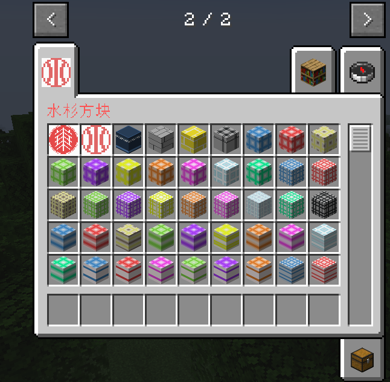

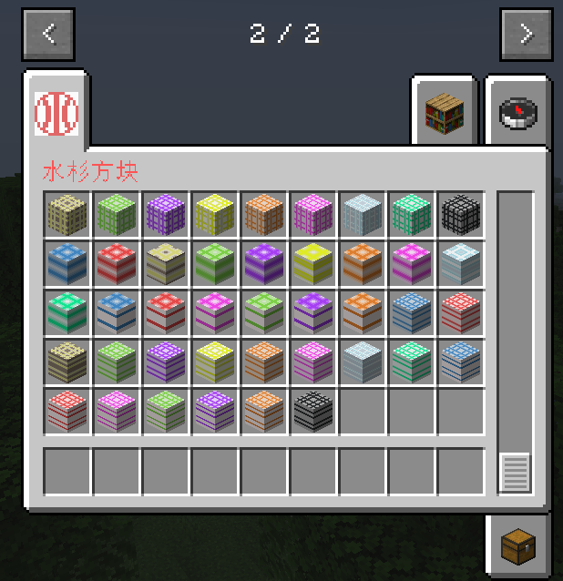

### 🧱 Building Blocks

- **Line Blocks**  
  Colorful line-pattern decorative blocks in multiple variants.Here are partial previews:
  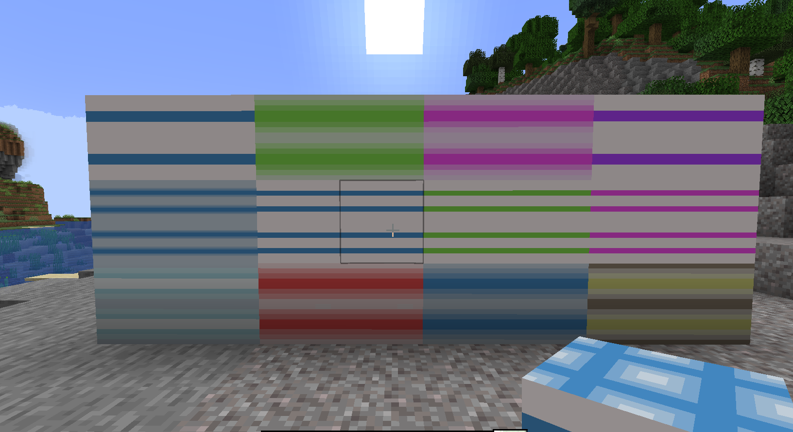

- **Grid Blocks**  
  Clean grid-style blocks for detailed architectural builds.Here are partial previews:
  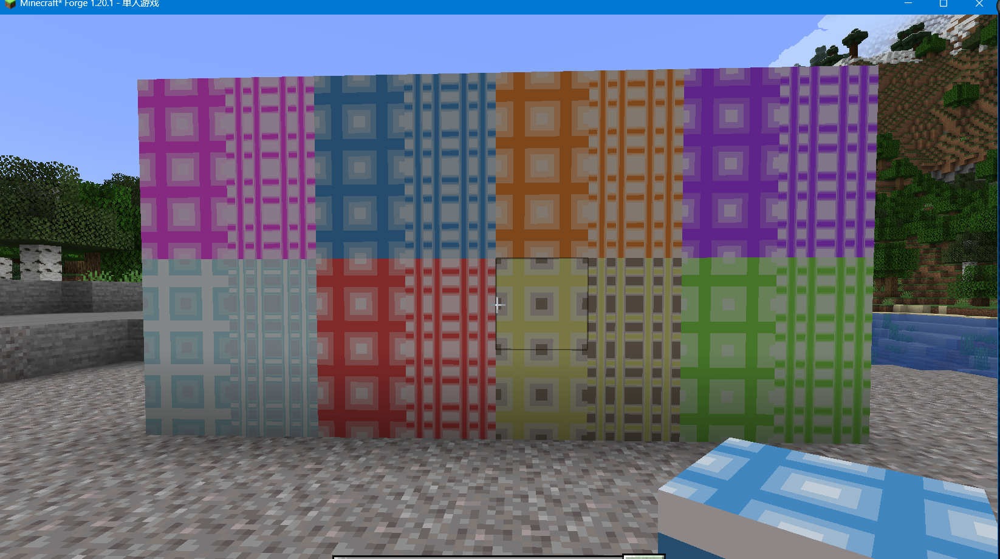

- **Others**  
  Additional decorative and functional blocks  
  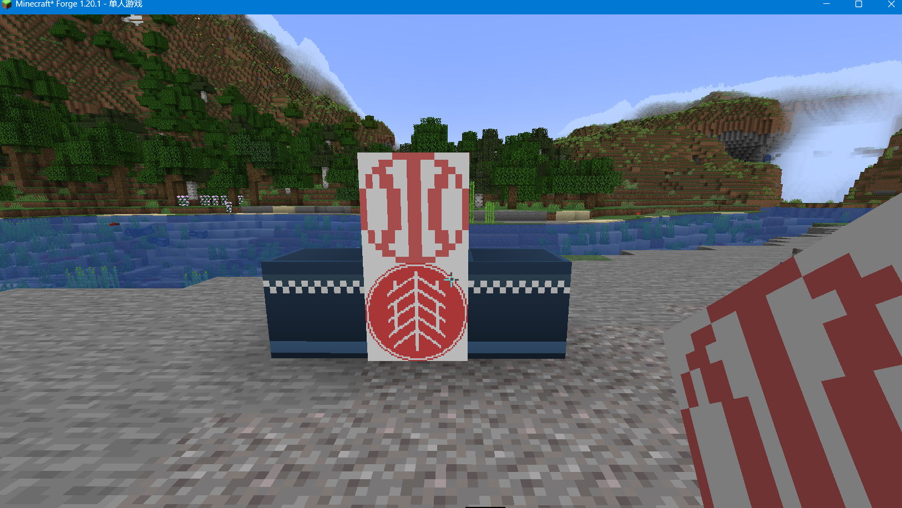  
  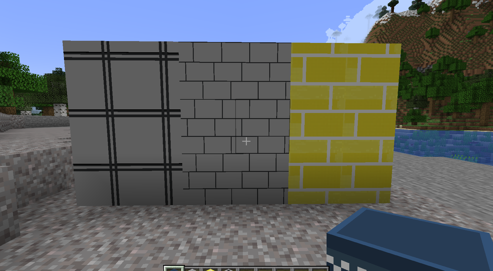

---

### ⚙️ Gameplay Mechanics

- Most blocks:  
  ➤ Crafted with **3 cobblestone → 4 blocks**  
  ➤ Require at least a **stone pickaxe**  

- Storage Box:  
  ➤ Size: **4 × 9 slots**

- Badges:  
  ➤ Crafted using **3 paper**

- 💥 Explosion Resistance:  
  ➤ All building blocks are **highly blast-resistant**  
  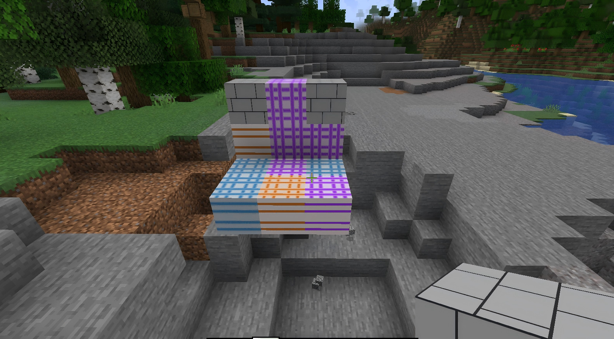

---

### 🏛️ Structures

#### 🏫 School Buildings
- Generate in **flat terrain & oceans**

- Dorm Lobby

/locate structure sbuild:dorm_5_lobby

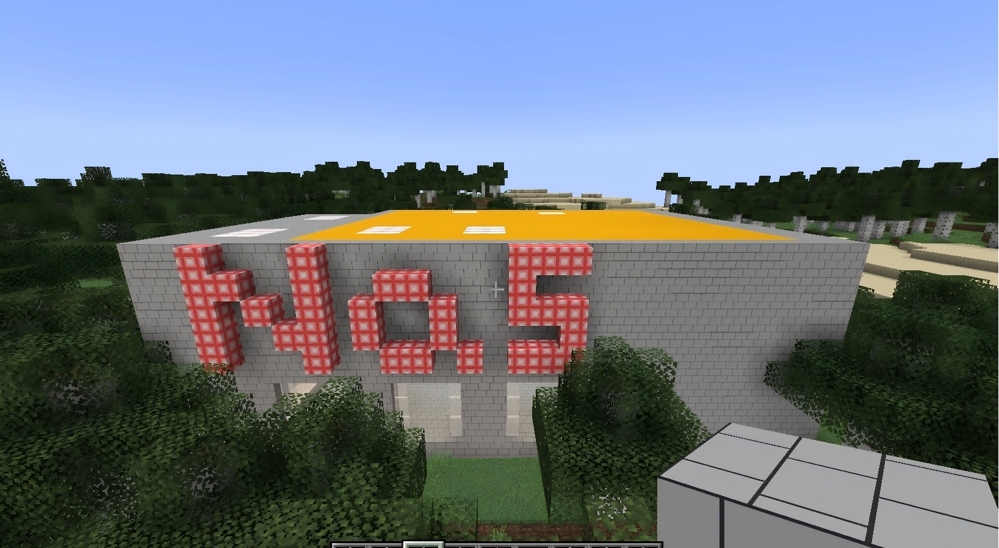

- School Gate:

/locate structure sbuild:school_gate

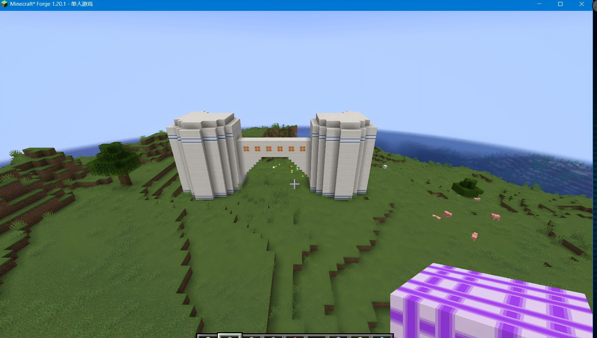

---

#### 📮 Post Stations
- Generate in **flat terrain & oceans**

/locate structure sbuild:post_station1

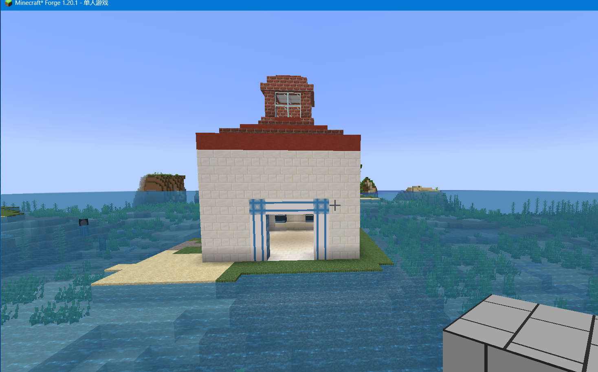

/locate structure sbuild:post_station2

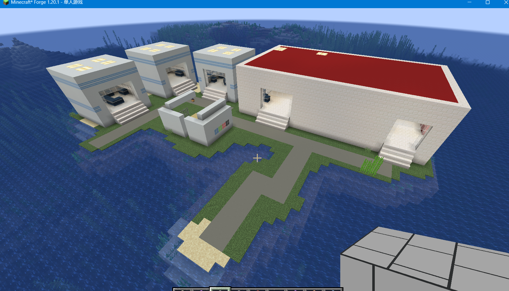

---

#### 🌉 Bridges
- Generate **only in river biomes**

/locate structure sbuild:bridge1

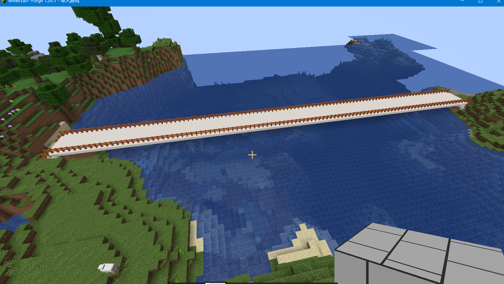


/locate structure sbuild:bridge2

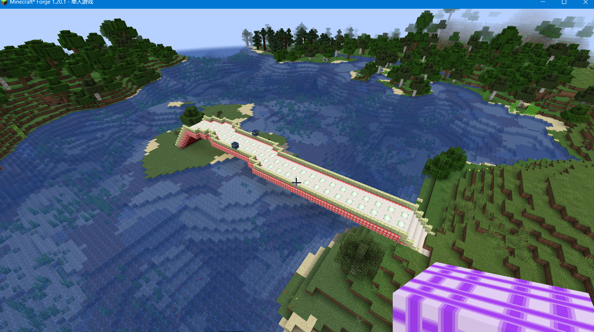

---

## 📦 Installation

1. Install [Minecraft Forge](https://files.minecraftforge.net/) (version 46 or higher)  
2. Download the latest **Sbuild** `.jar` from [Releases](https://github.com/KKTQawa/Sbuild/releases)
3. Place the `.jar` file into your `mods` folder  
4. Launch Minecraft using the Forge profile  

---

## ⚠️ Requirements

- Minecraft: **1.20 – 1.21**
- Forge: **46+**
- Java: **17+**

---

## 🛠️ Building from Source

```bash
./gradlew build
```
The compiled .jar will be located in:
```
build/libs/
```
📜 License

This project is licensed under the MIT License.
See the LICENSE
 file for details.

👥 Credits
Authors: 9090
Contributors: Liu Dongyu, 9090

---

## 📦 Acknowledgement

This project is based on the following template,and uses some of its code:

👉 https://github.com/Viola-Siemens/ECNU-Minecraft-Mod-Template

Special thanks to the authors of **ECNU-Minecraft-Mod-Template** for providing the foundation.
